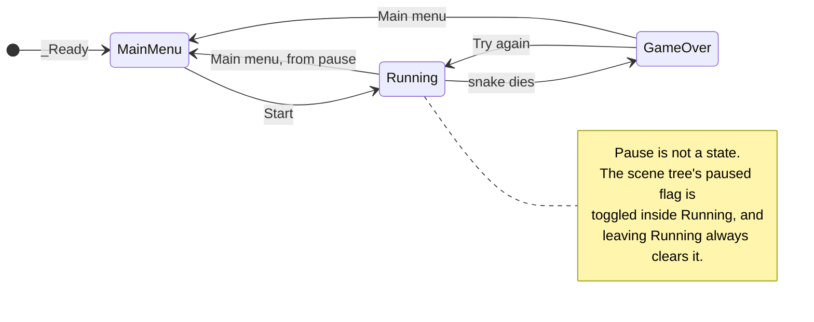

# Snake

Grid-based Snake built with **Godot 4 (.NET)** and **C#**.

Eat food to grow; hitting a wall or your own body ends the run.

## Controls

| Key                  | Action                             |
| -------------------- | ---------------------------------- |
| Arrow keys           | Turn                               |
| `Esc`                | Pause                              |
| Arrow keys / `Enter` | Navigate and activate menu buttons |

## Game flow

`Main` runs a small finite state machine. It's a **Moore machine**: every action
hangs off a _state_, never off a transition. Entry actions establish what must be
true on arrival regardless of where you came from, and exit actions tear down what
the state owned regardless of where you're going.

